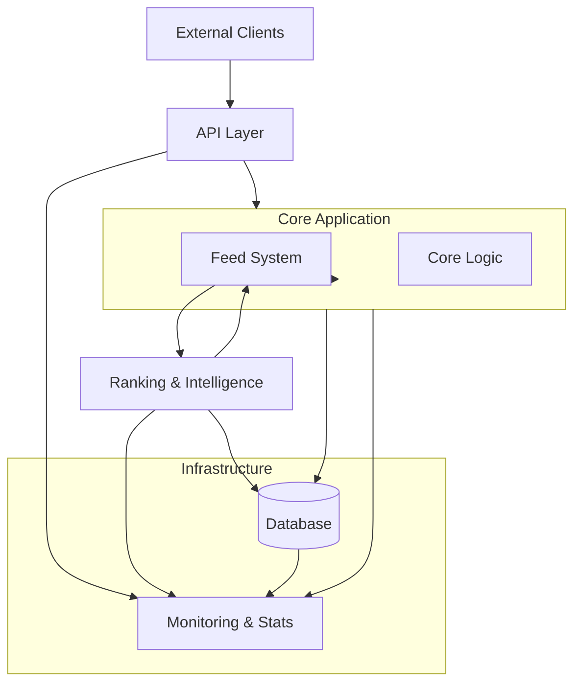

# Proposal
## Project Summary

In this project, a software system similar to the social network X (formerly Twitter) will be developed.  
Users of this platform will be able to publish their content in different formats such as images, videos, and text. They will also be able to interact with these posts, express whether they like or dislike content, and share their opinions regarding different posts and messages. The system will attempt to analyze user interactions and present content that is more aligned with the interests and preferences of each individual user.

## Problem and Objectives

This project is being developed as a Bachelor's thesis project in Computer Science. The primary goal of this project is not necessarily innovation or solving a completely new problem; this topic may even be considered a common and repetitive subject by some. However, the main objectives of this project are, first, reinforcing and applying the knowledge acquired throughout the course of study, and second, learning and utilizing new concepts and technologies.

A variety of concepts and tools will be used throughout this project. By applying different areas of computer science, including software engineering, machine learning and artificial intelligence, data science, DevOps, and related topics, the goal is to improve understanding and practical experience in these fields.

In this project, simply building a working product is not considered the final objective. Real-world and professional engineering concerns will also be carefully considered, including:

- Producing clear, organized, and detailed documentation
- Extensively testing the software and improving confidence in the correctness and efficiency of the system
- Automating various processes such as testing, documentation generation, compiling, and deployment preparation
- Separating different system responsibilities and applying practical software engineering principles
- Considering security and secure design as a fundamental aspect of the system

## System Overview

This software system is divided into separate components, each with specific responsibilities and implementation requirements. At a high level, the system consists of the following parts:

- A core application and main service responsible for:
    - Managing data, posts, and users
    - Generating feeds for users
- An intelligence service responsible for analyzing user behavior and determining recommended posts for users
- A database and persistent data storage layer

The primary focus of this project is on server-side operations, while other aspects may gradually be explored and implemented later if possible.

---

In the following sections, the requirements of the system will be analyzed in greater detail in order to establish the necessary foundations for system design and implementation.