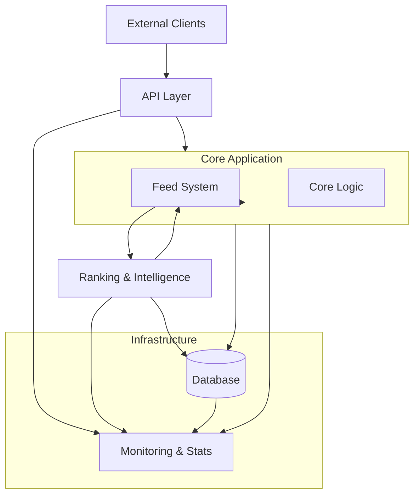

# پیشنهاده
## خلاصه ای از پروژه

در این پروژه، نرم افزاری همانند شبکه اجتماعی X («توییتر» پیشین)، ساخته می‌شود.
کاربران در این نرم افزار میتوانند محتوای خود را در فرمت‌های مختلف مانند تصویر، ویدیو و متن، منتشر کنند. آنها می‌توانند با این پیام‌ها تعامل کنند، میزان پسندیدن یا نپسندیدن محتوا را مشخص کنند و نظرات خود را در مورد پیام‌ها بیان کنند. این سیستم نیز سعی دارد تا با توجه به تعاملات کاربر با پست‌ها و پیام‌ها، آنهایی را در ادامه به اون نشان دهد که مطابق با علایق و ترجیحات آن کاربر باشد.

## مسئله و اهداف

این پروژه به عنوان پروژه کارشناسی(لیسانس) علوم کامپیوتر انجام می‌شود. هدف اصلی این پروژه شاید نوآوری یا حل مسئله‌ای جدید نباشد؛ ممکن است این موضوع از نظر برخی، موضوعی رایج و تکراری به نظر برسد. اما اهدافی که دنبال می‌شود، در ابتدا تثبیت و استفاده از آموخته‌های این دوران تحصیل، و در ادامه آن یادگیری و بکارگیری مباحث جدید است.

در این پروژه از مفاهیم و ابزار‌های متنوعی استفاده می‌شود، و با به کارگیری موضوعات مختلف در علوم کامپیوتر، از جمله مهندسی نرم افزار، یادگیری ماشین و هوش مصنوعی، علم داده، DevOps و ...، هدف، افزایش فهم و تسلط بر این حوزه‌ها است.
در این پروژه صرفا محصولی که کار می‌کند مقصد نهایی نیست؛ بلکه مسائل دنیای واقعی و حرفه‌ای نیز به دقت زیر نظر گرفته می‌شوند. جنبه‌هایی چون:

- تولید مستندات دقیق، دسته بندی شده و واضح
- مورد آزمایش قرار دادن برنامه به طور گسترده، و افزایش اطمینان از درستی و بهینگی عملکرد
- خودکار کردن بسیاری از کار‌ها، مانند انجام تست‌ها، تولید مستندات،  و آماده سازی برنامه و ....
- جداسازی وظایف مختلف سیستم و بکارگیری دیگر شیوه‌های کاربردی و مفید مهندسی نرم افزار
- توجه به امنیت و طراحی امن به عنوان اصلی بنیادین در سیستم

## شمایل سیستم

این نرم افزار به قسمت‌های مجزایی تقسیم می‌شود که هرکدام وظیفه مشخصی دارند و با توجه به ویژگی‌ها و نیازمندی‌های خود پیاده سازی می‌شوند. به صورت کلی این سیستم چنین اجزایی دارد:

- - سرویس اصلی و هسته سیستم که وظیفه آن شامل:  
	- مدیریت داده، پست‌ها و کاربران  
	- تولید feed برای کاربران
- سرویس هوشمند که رفتار کاربران را تحلیل می‌کند و پست‌های پیشنهادی برای کاربران مشخص می‌کند.
- پایگاه داده و ذخیره داده.

تمرکز بیشتر بر روی عملیات سمت سرور است و مسائل دیگر در ادامه در صورت امکان به تدریج مورد بررسی قرار میگیرند.

---

در ادامه، با تحلیل دقیق نیازمندی‌ها، پیش‌نیازهای طراحی و پیاده‌سازی سیستم مشخص خواهد شد.