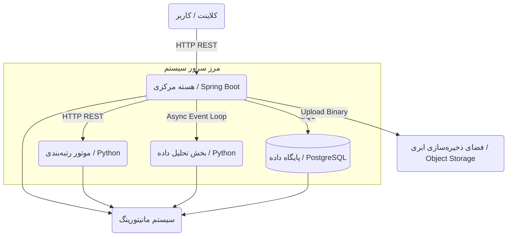
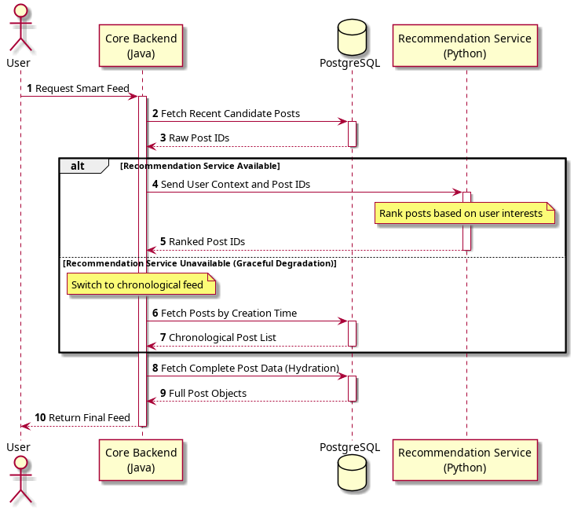

# معماری سیستم

این مستند ساختار کلی و معماری سیستم را توضیح می‌دهد. ابتدا معماری کلان و اجزای اصلی سیستم معرفی می‌شوند و سپس ساختار داخلی هر یک از زیرسیستم‌ها، نحوه تعامل آن‌ها با یکدیگر و جریان داده در بخش‌های مختلف بررسی می‌شود.

معماری این پروژه بر پایه جداسازی مسئولیت‌ها طراحی شده است. منطق اصلی برنامه، مدیریت داده‌ها و ارائه APIها در بخش Java/Spring Boot قرار دارند و بخش‌های مرتبط با تحلیل داده، رتبه‌بندی محتوا و پردازش‌های هوشمند در Python پیاده‌سازی می‌شوند. این جداسازی باعث می‌شود هر بخش متناسب با نیازهای خود توسعه پیدا کند و پردازش‌های سنگین تحلیلی بر عملکرد بخش اصلی سیستم تأثیر مستقیم نگذارند.

---
## معماری کلان سیستم

سیستم از چند بخش اصلی تشکیل شده است که هر کدام مسئولیت مشخصی بر عهده دارند.

هسته مرکزی سیستم نقطه ورود تمامی درخواست‌های کاربران است. تمامی عملیات مرتبط با مدیریت کاربران، مدیریت محتوا، تعاملات، احراز هویت و تولید فید از طریق این بخش انجام می‌شود.

در کنار هسته مرکزی، یک لایه هوشمند قرار دارد که شامل دو زیرسیستم مستقل است. زیرسیستم Recommendation مسئول رتبه‌بندی و شخصی‌سازی محتوا برای کاربران بوده و زیرسیستم Analytics وظیفه تحلیل داده‌ها و استخراج اطلاعات آماری را بر عهده دارد.

تمام اطلاعات ساخت‌یافته سیستم در PostgreSQL ذخیره می‌شوند. فایل‌های حجیم مانند تصاویر و ویدیوها در یک فضای ذخیره‌سازی فایل یا Object Storage نگهداری می‌شوند و تنها اطلاعات مربوط به آن‌ها در پایگاه داده ثبت می‌شود.

همچنین یک زیرسیستم مانیتورینگ برای جمع‌آوری اطلاعات عملکردی و مشاهده وضعیت داخلی سرویس‌ها در نظر گرفته شده است تا رفتار سیستم در زمان اجرا قابل بررسی و تحلیل باشد.

---
## ارتباط میان زیرسیستم‌ها

تمامی درخواست‌های کاربران ابتدا وارد هسته مرکزی سیستم می‌شوند. هسته مرکزی مسئول اعتبارسنجی درخواست‌ها، مدیریت داده‌ها و هماهنگی میان سایر بخش‌ها است.

در مواردی که نیاز به رتبه‌بندی محتوا وجود داشته باشد، هسته مرکزی اطلاعات مورد نیاز را به زیرسیستم Recommendation ارسال می‌کند و نتیجه رتبه‌بندی را دریافت می‌کند. این ارتباط به صورت همزمان انجام می‌شود زیرا نتیجه آن مستقیماً در پاسخ نهایی به کاربر مورد استفاده قرار می‌گیرد.

در مقابل، ارتباط با زیرسیستم Analytics به صورت غیرهمزمان انجام می‌شود. اطلاعات رفتاری کاربران در زمان اجرای سیستم ثبت می‌شوند اما پردازش آن‌ها در زمان دیگری انجام می‌شود تا عملیات تحلیلی باعث افزایش زمان پاسخگویی به کاربران نشود.

زیرسیستم مانیتورینگ نیز خارج از مسیر اصلی پردازش درخواست‌ها قرار دارد و اطلاعات اجرایی سرویس‌ها را جمع‌آوری و ذخیره می‌کند.

---
## هسته مرکزی (Core Backend)

هسته مرکزی مهم‌ترین بخش سیستم است و مسئول اجرای منطق اصلی برنامه محسوب می‌شود. تمامی درخواست‌های کاربران از این بخش عبور می‌کنند و تمامی عملیات اصلی سیستم در این قسمت مدیریت می‌شوند.

این بخش با استفاده از Spring Boot توسعه داده شده و از معماری لایه‌ای استفاده می‌کند. در لایه ورودی، درخواست‌های HTTP دریافت شده و عملیات احراز هویت، اعتبارسنجی و کنترل دسترسی انجام می‌شود. پس از آن منطق اصلی برنامه در لایه سرویس اجرا شده و در نهایت عملیات ذخیره‌سازی و بازیابی اطلاعات از طریق لایه دسترسی به داده انجام می‌شود.

این ساختار باعث می‌شود مسئولیت‌ها به شکل مشخصی از یکدیگر جدا شوند و تغییر در یک بخش کمترین تأثیر را بر سایر بخش‌ها داشته باشد.

هسته مرکزی مسئول مدیریت کاربران، پروفایل‌ها، پست‌ها، نظرات، تعاملات کاربران، روابط دنبال‌کردن، تولید فید و ارتباط با سایر زیرسیستم‌ها است.

در زمان ایجاد یک پست جدید، هسته مرکزی ابتدا اطلاعات ارسالی را اعتبارسنجی می‌کند. در صورت وجود فایل رسانه‌ای، فایل در فضای ذخیره‌سازی خارجی قرار گرفته و سپس اطلاعات پست همراه با آدرس فایل در پایگاه داده ذخیره می‌شود.

در زمان دریافت فید نیز این بخش داده‌های اولیه را از پایگاه داده دریافت کرده و در صورت نیاز برای رتبه‌بندی به زیرسیستم Recommendation ارسال می‌کند.

---
## موتور رتبه‌بندی محتوا (Recommendation System)

زیرسیستم Recommendation مسئول شخصی‌سازی محتوا و رتبه‌بندی پست‌ها برای کاربران است.

این بخش به صورت یک سرویس مستقل در Python پیاده‌سازی می‌شود و هیچ مسئولیتی در زمینه مدیریت کاربران یا ذخیره‌سازی داده‌ها ندارد. هدف اصلی آن دریافت داده‌های ورودی، اجرای الگوریتم‌های رتبه‌بندی و بازگرداندن نتایج به هسته مرکزی است.

در زمان تولید فید، هسته مرکزی مجموعه‌ای از پست‌های کاندید را انتخاب کرده و همراه با اطلاعات مورد نیاز کاربر به این زیرسیستم ارسال می‌کند. سرویس Recommendation این اطلاعات را پردازش کرده و برای هر پست یک امتیاز محاسبه می‌کند. سپس لیست پست‌ها بر اساس این امتیازها مرتب شده و نتیجه به هسته مرکزی بازگردانده می‌شود.

به دلیل اینکه این بخش وضعیت داخلی دائمی نگهداری نمی‌کند، می‌توان در آینده چندین نمونه از آن را به صورت همزمان اجرا کرد و بار پردازش را میان آن‌ها توزیع نمود.

همچنین در صورت بروز خطا یا از دسترس خارج شدن این سرویس، هسته مرکزی قادر خواهد بود بدون توقف سیستم، از فید زمانی ساده استفاده کند و سرویس‌دهی را ادامه دهد.

---
## زیرسیستم تحلیل داده (Analytics Subsystem)

این زیرسیستم مسئول تحلیل داده‌های رفتاری کاربران و تولید اطلاعات آماری برای مدیر سیستم است.

برخلاف Recommendation که در مسیر مستقیم درخواست‌های کاربران قرار دارد، Analytics به صورت غیرهمزمان فعالیت می‌کند و پردازش‌های آن تأثیری بر زمان پاسخگویی سیستم ندارد.

رویدادهای مختلف کاربران مانند مشاهده محتوا، لایک کردن، ثبت نظر یا دنبال کردن کاربران در طول اجرای سیستم ثبت می‌شوند. این اطلاعات در بازه‌های زمانی مشخص پردازش شده و برای استخراج شاخص‌های آماری مورد استفاده قرار می‌گیرند.

نتایج حاصل از این پردازش‌ها می‌توانند برای تولید گزارش‌های مدیریتی، بررسی رفتار کاربران، تحلیل میزان فعالیت سیستم و ارزیابی عملکرد الگوریتم‌های پیشنهاددهی مورد استفاده قرار گیرند.

جداسازی Analytics از بخش اصلی سیستم باعث می‌شود پردازش‌های سنگین تحلیلی تأثیری بر عملیات روزمره کاربران نداشته باشند و هر بخش بتواند مستقل از دیگری توسعه پیدا کند.

---

## سیستم مانیتورینگ

مانیتورینگ بخشی از مسیر پردازش درخواست‌های کاربران نیست، اما نقش مهمی در نگهداری و مدیریت سیستم دارد.

تمامی سرویس‌های اصلی سیستم اطلاعات اجرایی خود را منتشر می‌کنند. این اطلاعات شامل زمان پاسخگویی درخواست‌ها، میزان مصرف منابع، تعداد خطاها، وضعیت سرویس‌ها و سایر متریک‌های فنی است.

Prometheus وظیفه جمع‌آوری و ذخیره این اطلاعات را بر عهده دارد و Grafana برای نمایش و تحلیل آن‌ها استفاده می‌شود.

وجود این زیرسیستم امکان بررسی عملکرد سیستم، شناسایی گلوگاه‌های احتمالی و تحلیل رفتار سرویس‌ها را فراهم می‌کند. همچنین در صورت بروز مشکلات اجرایی، اطلاعات لازم برای عیب‌یابی و بررسی علت خطاها در دسترس خواهد بود.

---
## ذخیره‌سازی داده‌ها

سیستم از دو روش مختلف برای ذخیره‌سازی داده‌ها استفاده می‌کند.

اطلاعات ساخت‌یافته مانند کاربران، پست‌ها، نظرات، تعاملات و روابط میان کاربران در PostgreSQL ذخیره می‌شوند. این داده‌ها دارای روابط مشخص و محدودیت‌های یکپارچگی هستند و نیاز به قابلیت‌های تراکنشی پایگاه داده رابطه‌ای دارند.

در مقابل، فایل‌های رسانه‌ای مانند تصاویر و ویدیوها در یک فضای ذخیره‌سازی فایل مستقل نگهداری می‌شوند. این رویکرد باعث می‌شود پایگاه داده از نگهداری فایل‌های حجیم آزاد شده و مدیریت داده‌ها ساده‌تر شود.

در نتیجه هر نوع داده در بستری ذخیره می‌شود که برای آن مناسب‌تر است و این موضوع به بهبود عملکرد و نگهداری سیستم کمک می‌کند.
